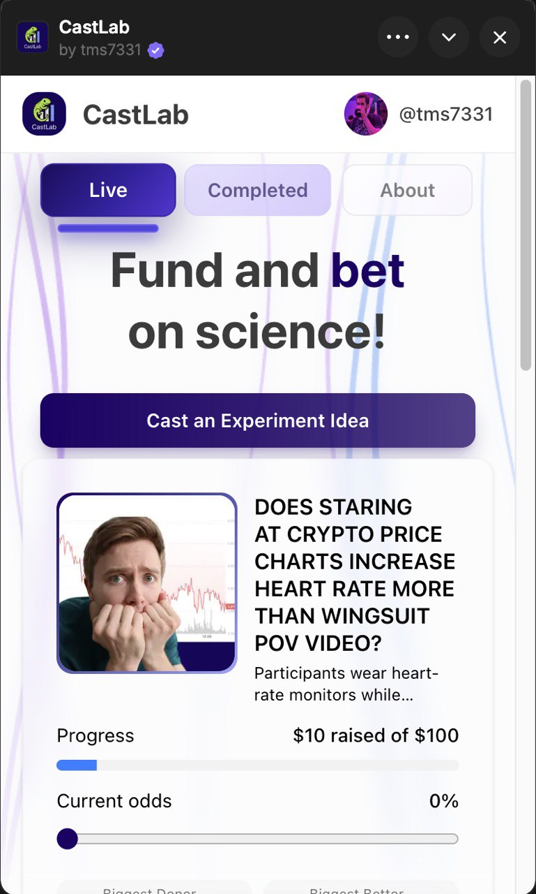

# CastLab

CastLab is a [Farcaster](https://www.farcaster.xyz/) [mini app](https://miniapps.farcaster.xyz/docs/getting-started) for crowdfunding and betting on scientific experiments.

This project represents the beginning of exploring prediction markets for science.

<p align="center">
  
</p>

## What Makes CastLab Compelling

**Real Scientific Research**: Initial experiments are run by the team at [Cosimo Research](https://cosimoresearch.com/journal), an independent scientific research service. They design protocols, execute experiments, analyze data, and share updates along the way.

**Flexible Funding**: Back experiments you find compelling. Studies launch once they meet their minimum funding goal, but more support means stronger evidence. You can withdraw your contribution anytime before a study reaches its goal.

**Prediction Markets**: Think you know how an experiment will turn out? Place bets on outcomes using parimutuel betting - the total pool is divided among those who guessed correctly, with payouts proportional to their stakes. If the experiment doesn't run, you get your money back.

## Getting Started

First, run the development server:

```bash
npm run dev
# or
yarn dev
# or
pnpm dev
```

Open [http://localhost:3000](http://localhost:3000) with your browser to see the result.

## Smart Contracts

CastLab's smart contracts are maintained in a separate repository: [castlab-contracts](https://github.com/tms7331/castlab-contracts)

## Tech Stack

This is a [Next.js](https://nextjs.org) project built with modern web technologies for optimal performance and developer experience.

